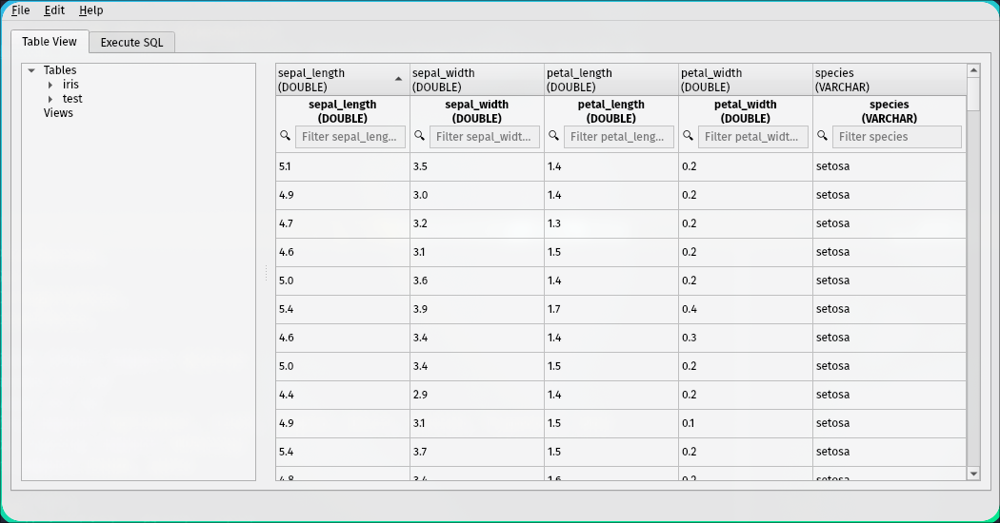
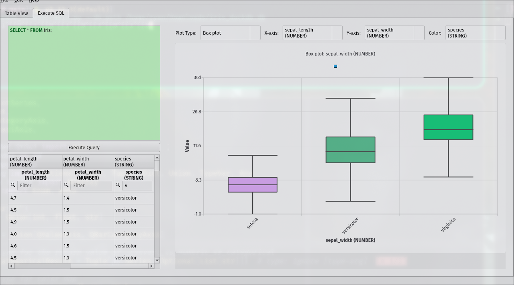

# Duckdb Browser

Duckdb Browser is GUI to interact witha Duckdb database. It uses Pandas and QT to provide a simple interface to interact with Duckdb.

## Features

- Sort and Browse Tables
- Filter Tables
- Directly Edit data in Tables and persit changes to the database
- Execute SQL Queries
- Plot results of SQL Queries

## Installation

```sh
pipx install 'git+https://github.com/RyanGreenup/duckdb_viewer'
```

## Usage

```sh
duckdb-browser --db-path path/to/your/data.duckdb
```

## Screenshots




